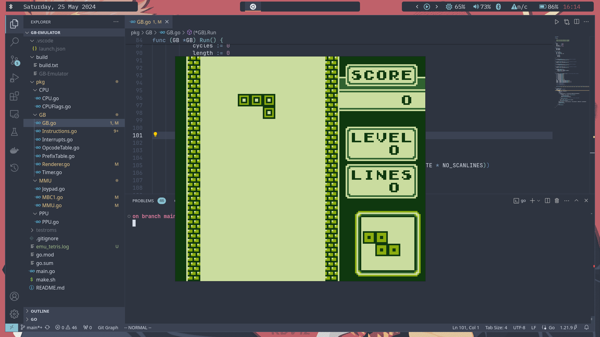

## GB-Emulator

An emulator written for the DMG-Gameboy in golang. I wrote this to get more familiar with writing larger projects.
As of now Tetris is the only game that runs.



Tests passed so far:
- Blargg's test rom (individual)
- DMG-Acid2

Run script to compile binary

```bash
bash make.sh
```

Execute binary in `build` directory
```bash
./GB-Emulator <path_to_rom>
```